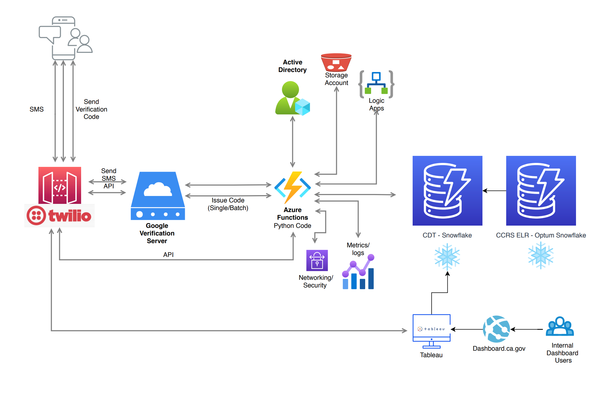

# Introduction 
SMS Text CA citizens who may have been exposed to people having COVID19 symptoms.
## Table of contents
* [Open Source Code Repos](#open-source-code-repos)
* [Programming Language](#programming-language)
* [External Dependencies](#external-dependencies)
* [Release Notes](#release-notes)
* [Technical Details](#technical-details)
* [Network Diagram](#network-diagram)

#Open Source Code Repos
https://github.com/StateOfCalifornia/CA_NOTIFY
#Programming Language
Python
#External-Dependencies
| SnowFlake  (Source Phone#)  Select 100 phone# @ a time   | Twillio   (Phone# Validation API)  Takes only one phone# at a time, but the batch program threaded 10 simultaneous run at a time   | Google  (SMS Text API)   SMS Text 10 phone# at a time   |
|-------------------------------------------------------------------------------------------------------------------------------------------------------------|-------------------------------------------------------------------------------------------------------------------------------------------------------------------------------------------------------------------------------------------------|----------------------------------------------------------------------------------------------------------------------------------------------------|---------------------------------------------------------------------------|---|---|
#Release Notes
|12/13/2020| Threaded 10 simultaneous run (one phone# @ a time) through Twillio and batch 10 phone# at a time to Google.  Mark (1) as text sent, (0) as no text sent. Update write back table to SnowFlake to filter out already processed phone# for next batch of ten (10).|
|-------------------------------------------------------------------------------------------------------------------------------------------------------------|-------------------------------------------------------------------------------------------------------------------------------------------------------------------------------------------------------------------------------------------------|----------------------------------------------------------------------------------------------------------------------------------------------------|---------------------------------------------------------------------------|---|---|

# Technical Details
The execution of the CA Notify pipeline can be visualized as a series of epochs each consisting of multiple batches. The main function calls **orchestrate_epochs** to initiate this process. The number of epochs to execute in a single run of the pipeline is defined in the environment variable **EPOCH_COUNT**. 

The execution of each epoch occurs in **execute_single_epoch**. Each epoch consists of a single call to **acquire_data** to obtain up to 100 records in bulk from Snowflake, followed by a call to **orchestrate_batches.**  Orchestrate_batches accepts the data obtained from Snowflake to iteratively create and execute batches of **BATCH_SIZE** using the **execute_single_batch** function.

Before proceeding to discuss the specifics of **execute_single_batch**, it's worth noting that BATCH_SIZE and EPOCH_COUNT are hyperparameters that may be adjusted to optimize performance and reliability. Our constraints are the following:
- BATCH_SIZE must be less than 10 due to Google Verification Server requirements. 
- EPOCH_COUNT should be as high as possible without being so high that the total execution lasts longer than two minutes (this is due to an Azure Functions constraint and may vary on other cloud environments)
- The combined EPOCH_COUNT and BATCH_SIZE execution should yield runs that process as many records as possible without exceeding the max limit from Google Verification Server

The optimal values for us were 3 for EPOCH_COUNT and 10 for BATCH_SIZE. To provide an additional buffer in cases where the epochs execute faster than the acceptable limit we enforce a minimum time of 60 Seconds per epoch (with any difference being made up with sleeps between epochs).

**Execute_single_batch** runs the following sequence of steps on each batch:
1. Preprocesses the phone numbers in each batch using generate_recepient_lists function. This function uses the Twilio lookup API via a call to pre_check_and_annotate in pre_check.py to determine whether a phone is a valid or invalid. The exact implementation of pre_check_and_annotate employs multithreading to process all the records in a batch in parallel.
2. The valid_recepients list is wrapped into a Python object and passed to call_verification_server in verification_server.py. 
3. The response from the verification server is analyzed to denote whether each phone was successful or not by evaluate_response. 
4. Both the evaluated responses (in valid_recepients_evaluated) and invalid_recepients are passed to the writeback function. We only care about whether a message was successfully sent to the repience or not - not about why it wasn't sent in the event of a failure. Thus, valid_recepients_evaluated contains both passes that sent, and fails that failed on the Google verification server. Invalid_recepients contains those records that failed the pre check and were never even sent to the verification server. Write_back joins the results of these two lists and passes the data to Snowflake in a single write per batch.

Both the evaluated responses (in valid_recepients_evaluated) and invalid_recepients are passed to the writeback function. We only care about whether a message was successfully sent to the repience or not - not about why it wasn't sent in the event of a failure. Thus, valid_recepients_evaluated contains both passes that sent, and fails that failed on the Google verification server. Invalid_recepients contains those records that failed the pre check and were never even sent to the verification server. Write_back joins the results of these two lists and passes the data to Snowflake in a single write per batch.

The key optimization decision that significantly improved the throughput of our pipeline were:
- Reading from Snowflake only once *per epoch*
- Writing to Snowflake only once *per batch*
- Calling the Google Verification server using the batch-issue endpoint
- Parallelizing the calls to Twilio using multithreading
#Network Diagram

